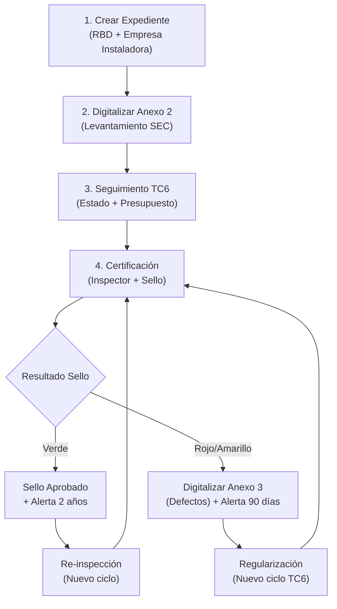
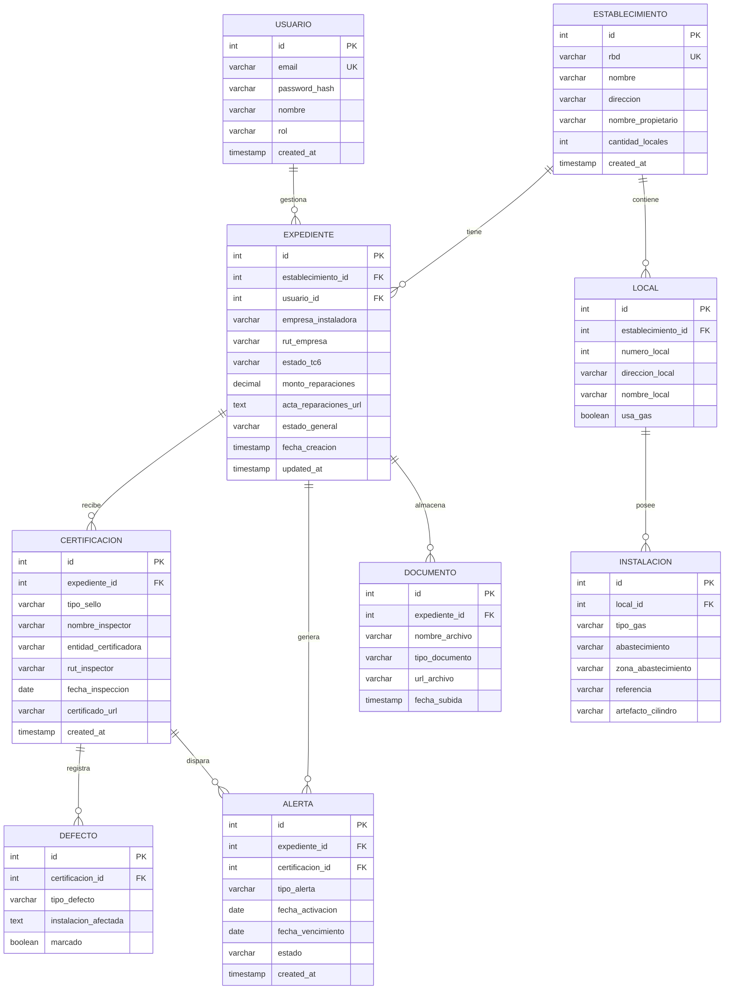

# Plan de Implementación — MVP Sello Verde

## Contexto

El SLEP (Servicio Local de Educación Pública) necesita un sistema para gestionar el ciclo de vida completo de las certificaciones de gas (Sello Verde) en Establecimientos Educacionales (EE). El usuario principal es el **encargado de infraestructura del SLEP**, quien actúa como digitador y controlador del proceso. El MVP piloto cubre **20 establecimientos**.

---

## Fase 1: Análisis y Diseño

### 1.1 Flujo de Información



**Actores del sistema:**
- **Usuario SLEP (único):** Encargado de Infraestructura. Digitaliza, monitorea, gestiona.
- **Actores externos (no usan la plataforma):** Empresa instaladora, Entidad certificadora, SEC.

**Flujo detallado:**
1. El encargado SLEP **crea un expediente** vinculado a un RBD y registra la empresa instaladora adjudicada.
2. Recibe información física del levantamiento y **digitaliza el Anexo 2** (locales, tipo de gas, zonas, artefactos).
3. **Actualiza estados del proyecto TC6**: `En elaboración` → `Ingresado a la SEC` → `Observado` → `TC6 Aprobado`. Carga el acta de reparaciones y montos.
4. Tras inspección, **registra al inspector/entidad certificadora** y **califica el sello**:
   - **Verde:** Marca aprobado, adjunta certificado, el sistema activa alerta a 2 años.
   - **Rojo/Amarillo:** Digitaliza Anexo 3 (checklist de defectos), el sistema activa alerta a 90 días.

---

### 1.2 Modelo Entidad-Relación (ERD)



**Enums y valores predefinidos:**

| Campo | Valores |
|---|---|
| `estado_tc6` | `sin_iniciar`, `en_elaboracion`, `ingresado_sec`, `observado`, `tc6_aprobado` |
| `estado_general` | `sin_gestion`, `en_levantamiento`, `en_proyecto`, `en_certificacion`, `sello_verde`, `sello_rojo`, `sello_amarillo`, `en_regularizacion` |
| `tipo_sello` | `verde`, `amarillo`, `rojo` |
| `tipo_gas` | `GLP`, `Gas Natural` |
| `abastecimiento` | `GDR`, `Equipo GLP`, `Cilindros 45 kg`, `Cilindros 11-15 kg`, `GRANEL` |
| `zona_abastecimiento` | `Casino`, `Camarines`, `Sala de clases`, `Otros` |
| `tipo_alerta` | `vencimiento_sello_verde`, `plazo_regularizacion_90d` |
| `estado_alerta` | `activa`, `notificada`, `resuelta`, `vencida` |
| `tipo_defecto` | `fugas_artefactos`, `fugas_red`, `fugas_medidor`, `sin_conducto_evacuacion`, `co_superior_50ppm`, `artefacto_a_en_aulas`, `lectura_tiro_igual` |

---

### 1.3 Mapa de Endpoints API (REST)

#### Autenticación
| Método | Endpoint | Descripción |
|--------|----------|-------------|
| `POST` | `/api/auth/login` | Login con email/password (validación directa en BD) |
| `GET` | `/api/auth/me` | Datos del usuario autenticado |

#### Establecimientos
| Método | Endpoint | Descripción |
|--------|----------|-------------|
| `GET` | `/api/establecimientos` | Listar todos (con filtros por RBD, estado) |
| `GET` | `/api/establecimientos/:id` | Detalle de un establecimiento |
| `POST` | `/api/establecimientos` | Crear establecimiento |
| `PUT` | `/api/establecimientos/:id` | Actualizar establecimiento |

#### Locales
| Método | Endpoint | Descripción |
|--------|----------|-------------|
| `GET` | `/api/establecimientos/:id/locales` | Listar locales del establecimiento |
| `POST` | `/api/establecimientos/:id/locales` | Crear local (parte de Anexo 2) |
| `PUT` | `/api/locales/:id` | Actualizar local |

#### Instalaciones
| Método | Endpoint | Descripción |
|--------|----------|-------------|
| `GET` | `/api/locales/:id/instalaciones` | Listar instalaciones del local |
| `POST` | `/api/locales/:id/instalaciones` | Crear instalación (Anexo 2 — Tabla 2) |
| `PUT` | `/api/instalaciones/:id` | Actualizar instalación |

#### Expedientes
| Método | Endpoint | Descripción |
|--------|----------|-------------|
| `GET` | `/api/expedientes` | Listar expedientes (con estado, alertas) |
| `GET` | `/api/expedientes/:id` | Detalle completo del expediente |
| `POST` | `/api/expedientes` | Crear expediente (vincula RBD + empresa) |
| `PUT` | `/api/expedientes/:id` | Actualizar expediente (estado TC6, montos) |
| `PATCH` | `/api/expedientes/:id/estado-tc6` | Transición de estado TC6 |

#### Certificaciones
| Método | Endpoint | Descripción |
|--------|----------|-------------|
| `GET` | `/api/expedientes/:id/certificaciones` | Historial de certificaciones |
| `POST` | `/api/expedientes/:id/certificaciones` | Registrar certificación (genera alertas) |

#### Defectos (Anexo 3)
| Método | Endpoint | Descripción |
|--------|----------|-------------|
| `GET` | `/api/certificaciones/:id/defectos` | Listar defectos de una certificación |
| `POST` | `/api/certificaciones/:id/defectos` | Registrar defectos (bulk) |

#### Alertas
| Método | Endpoint | Descripción |
|--------|----------|-------------|
| `GET` | `/api/alertas` | Listar alertas (filtrar por estado, tipo) |
| `PATCH` | `/api/alertas/:id` | Marcar como resuelta/notificada |

#### Dashboard
| Método | Endpoint | Descripción |
|--------|----------|-------------|
| `GET` | `/api/dashboard/resumen` | KPIs: totales por estado, alertas pendientes |
| `GET` | `/api/dashboard/alertas-proximas` | Alertas próximas a vencer (próximos 30 días) |

#### Documentos
| Método | Endpoint | Descripción |
|--------|----------|-------------|
| `POST` | `/api/expedientes/:id/documentos` | Subir documento al expediente |
| `GET` | `/api/expedientes/:id/documentos` | Listar documentos del expediente |

---

## Fase 2: Infraestructura (Docker + BD)

### 2.1 Estructura del Proyecto

```
sello-verde/
├── docker-compose.yml
├── .env
├── frontend/                 # Next.js App
│   ├── Dockerfile
│   ├── package.json
│   ├── next.config.js
│   ├── public/
│   │   └── fonts/           # Satoshi, Cabinet Grotesk
│   └── src/
│       ├── app/
│       │   ├── layout.tsx
│       │   ├── page.tsx          # Dashboard
│       │   ├── globals.css
│       │   ├── login/
│       │   ├── establecimientos/
│       │   │   ├── page.tsx      # Listado
│       │   │   └── [id]/
│       │   │       ├── page.tsx  # Detalle
│       │   │       └── anexo2/
│       │   │           └── page.tsx
│       │   ├── expedientes/
│       │   │   ├── page.tsx
│       │   │   └── [id]/
│       │   │       ├── page.tsx
│       │   │       └── certificacion/
│       │   │           └── page.tsx
│       │   └── alertas/
│       │       └── page.tsx
│       ├── components/
│       │   ├── ui/              # Botones, inputs, cards, modals
│       │   ├── layout/          # Sidebar, Header, ThemeToggle
│       │   ├── dashboard/       # KPICard, StatusChart
│       │   ├── forms/           # Anexo2Form, Anexo3Form, CertForm
│       │   └── tables/          # EstabTable, AlertaTable
│       ├── lib/
│       │   ├── api.ts           # Fetch wrapper
│       │   └── constants.ts     # Enums, options
│       └── hooks/
│           └── useAuth.ts
├── backend/                  # NestJS App
│   ├── Dockerfile
│   ├── package.json
│   └── src/
│       ├── main.ts
│       ├── app.module.ts
│       ├── auth/
│       │   ├── auth.module.ts
│       │   ├── auth.controller.ts
│       │   ├── auth.service.ts
│       │   └── auth.guard.ts
│       ├── establecimientos/
│       │   ├── establecimientos.module.ts
│       │   ├── establecimientos.controller.ts
│       │   ├── establecimientos.service.ts
│       │   └── entities/
│       │       ├── establecimiento.entity.ts
│       │       └── local.entity.ts
│       ├── expedientes/
│       │   ├── expedientes.module.ts
│       │   ├── expedientes.controller.ts
│       │   ├── expedientes.service.ts
│       │   └── entities/
│       │       └── expediente.entity.ts
│       ├── instalaciones/
│       │   ├── instalaciones.module.ts
│       │   ├── instalaciones.controller.ts
│       │   ├── instalaciones.service.ts
│       │   └── entities/
│       │       └── instalacion.entity.ts
│       ├── certificaciones/
│       │   ├── certificaciones.module.ts
│       │   ├── certificaciones.controller.ts
│       │   ├── certificaciones.service.ts
│       │   └── entities/
│       │       ├── certificacion.entity.ts
│       │       └── defecto.entity.ts
│       ├── alertas/
│       │   ├── alertas.module.ts
│       │   ├── alertas.controller.ts
│       │   ├── alertas.service.ts
│       │   ├── alertas.cron.ts         # Cron para verificar vencimientos
│       │   └── entities/
│       │       └── alerta.entity.ts
│       ├── documentos/
│       │   ├── documentos.module.ts
│       │   ├── documentos.controller.ts
│       │   └── documentos.service.ts
│       ├── dashboard/
│       │   ├── dashboard.module.ts
│       │   ├── dashboard.controller.ts
│       │   └── dashboard.service.ts
│       ├── database/
│       │   ├── database.module.ts
│       │   └── seeds/
│       │       └── seed.ts             # Data mockup
│       └── common/
│           ├── dto/
│           └── enums/
└── database/
    └── init.sql                  # Schema inicial + seed data
```

### 2.2 Docker Compose

Tres servicios:
- **db**: PostgreSQL 16 con volume persistente + `init.sql`
- **backend**: NestJS (puerto 3001) con hot-reload, conecta a `db`
- **frontend**: Next.js (puerto 3000) con hot-reload, conecta a `backend`

### 2.3 Data Mockup

Se cargarán **20 establecimientos** (piloto real) con datos representativos:
- 5 EE con `sello_verde` (alertas de vencimiento a 2 años activas)
- 5 EE con `en_proyecto` (distintos estados de TC6)
- 4 EE con `sello_rojo` o `sello_amarillo` (con defectos digitalizados y alertas a 90 días)
- 3 EE con `en_levantamiento` (Anexo 2 parcialmente completado)
- 3 EE con `sin_gestion`

Un usuario SLEP pre-cargado: `admin@slep.cl` / `slep2024`

---

## Fase 3: Desarrollo Modular

### 3.1 Backend (NestJS)

**Orden de implementación:**
1. Configuración base (TypeORM, PostgreSQL, CORS, validación)
2. Módulo `auth` (login simplificado, guard de sesión por cookie/header)
3. Módulo `establecimientos` + `locales` (CRUD + Anexo 2 parcial)
4. Módulo `instalaciones` (Anexo 2 completo — Tabla 2)
5. Módulo `expedientes` (CRUD + máquina de estados TC6)
6. Módulo `certificaciones` + `defectos` (Sello + Anexo 3)
7. Módulo `alertas` (CRUD + cron job de verificación diaria)
8. Módulo `dashboard` (queries agregadas para KPIs)
9. Módulo `documentos` (upload básico a filesystem)

**Lógica de negocio clave:**
- Al crear una certificación con `tipo_sello = verde`, el servicio **crea automáticamente** una alerta de tipo `vencimiento_sello_verde` con `fecha_vencimiento = fecha_inspeccion + 2 años`.
- Al crear una certificación con `tipo_sello = rojo | amarillo`, se genera alerta `plazo_regularizacion_90d` con `fecha_vencimiento = fecha_inspeccion + 90 días`.
- Un **cron job diario** revisa alertas activas y marca como `notificada` las que están a 30 días o menos de vencer.
- La transición de `estado_tc6` sigue una máquina de estados estricta: solo avanza en el orden definido (o retrocede a `observado`).

### 3.2 Frontend (Next.js)

**Dirección estética:** Utilitaria-refinada. Inspiración en dashboards industriales escandinavos.
- Superficies warm beige (`#f7f6f2`) con acentos teal (`#01696f`).
- Tipografía: **Satoshi** (display) + **Cabinet Grotesk** (body) desde Fontshare.
- Layout asimétrico con sidebar colapsable, overlapping cards en dashboard.
- Micro-animaciones: staggered card reveals, progress bars animadas en estados TC6.
- Light/Dark mode con toggle.
- Noise texture sutil en backgrounds.

**Páginas principales:**

| Ruta | Función |
|------|---------|
| `/login` | Acceso del encargado SLEP |
| `/` | Dashboard con KPIs, alertas próximas, tabla resumen |
| `/establecimientos` | Listado filtrable de EE |
| `/establecimientos/[id]` | Detalle + locales + acceso a Anexo 2 |
| `/establecimientos/[id]/anexo2` | Formulario digitalizado Anexo 2 completo |
| `/expedientes` | Listado de expedientes con estado visual |
| `/expedientes/[id]` | Timeline del expediente + documentos + certificaciones |
| `/expedientes/[id]/certificacion` | Formulario de certificación + Anexo 3 condicional |
| `/alertas` | Panel de alertas con filtros y acciones |

---

## User Review Required

> [!IMPORTANT]
> **Autenticación simplificada:** Se implementará un guard básico que valida credenciales contra la BD (hash bcrypt) y devuelve un token simple en cookie httpOnly. No se implementará OAuth ni JWT complejo. ¿Es aceptable para el MVP?

> [!IMPORTANT]
> **Upload de documentos:** Para el MVP, los archivos se almacenarán en el filesystem del contenedor Docker (volume montado). No se integrará almacenamiento cloud (S3, GCS). ¿Es suficiente?

> [!IMPORTANT]
> **Alertas:** Las alertas se generan automáticamente pero se muestran **solo dentro de la plataforma** (no se envían emails ni notificaciones push). ¿Es aceptable para el piloto?

## Open Questions

> [!WARNING]
> **Firma/validación del Anexo 2 (Sección D):** El documento de requisitos menciona campos para RUT del propietario y RUT del representante legal de la entidad certificadora. ¿Se implementan como campos de texto simples en el formulario, o se omiten en el MVP?

> [!NOTE]
> **Datos de los 20 establecimientos piloto:** ¿Tienes datos reales (RBD, nombres, direcciones) de los 20 EE del piloto para usar como seed, o genero datos ficticios representativos?

---

## Verification Plan

### Automated Tests
```bash
# Backend: tests unitarios de servicios críticos
cd backend && npm run test

# Verificar que los contenedores inician correctamente
docker-compose up -d && docker-compose ps

# Verificar seed data
docker exec -it sello-verde-db psql -U postgres -d sello_verde -c "SELECT COUNT(*) FROM establecimiento;"
```

### Manual Verification
- Navegar el flujo completo: Login → Dashboard → Crear expediente → Llenar Anexo 2 → Avanzar TC6 → Certificar → Verificar alerta generada.
- Toggle light/dark mode en todas las páginas.
- Verificar responsividad desde 375px.
- Confirmar que las alertas aparecen en el dashboard según los datos mockup.
